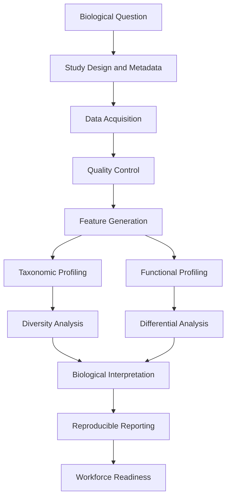

# Technical Appendix

:::cdi-message
- **ID:** MICROB-999
- **Type:** Appendix
- **Audience:** Students, researchers, analysts, mentors, and practitioners
- **Theme:** Reusable reference material for the Microbiome Analysis System
:::

## Purpose of the Appendix

This appendix provides reusable notes, checklists, workflow commands, and reference structures for the Microbiome Analysis System.

The appendix is designed to support:

- project setup
- workflow review
- teaching and mentorship
- reproducibility checks
- portfolio development
- future microbiome analysis projects

It does not replace the main chapters. Instead, it provides quick-reference material that can be reused across MAS projects.

## Complete MAS Workflow

The Microbiome Analysis System follows this structure:

```{mermaid}
flowchart TB
  A[Study Design and Metadata] --> B[Sample Collection and Sequencing]
  B --> C[Data Acquisition]
  C --> D[Quality Control]
  D --> E[Feature Generation]
  E --> F[Taxonomic Profiling]
  E --> G[Functional Profiling]
  F --> H[Diversity Analysis]
  G --> I[Differential Analysis]
  H --> J[Biological Interpretation]
  I --> J
  J --> K[Reproducible Reporting]
  K --> L[Workforce Readiness]
```

The system is designed to move from biological question to defensible report.

## Recommended Project Structure

A practical MAS project may use the following structure:

```text
microbiome-analysis-system/
├── _quarto.yml
├── index.qmd
├── 00-preface.qmd
├── 01-system-overview.qmd
├── 02-study-design-and-metadata.qmd
├── 03-sample-collection-and-sequencing.qmd
├── 04-data-acquisition.qmd
├── 05-quality-control.qmd
├── 06-feature-generation.qmd
├── 07-taxonomic-profiling.qmd
├── 08-diversity-analysis.qmd
├── 09-functional-profiling.qmd
├── 10-differential-analysis.qmd
├── 11-biological-interpretation.qmd
├── 12-reproducible-reporting.qmd
├── 13-workforce-readiness.qmd
├── 999-appendix.qmd
├── 999-references.qmd
├── scripts/
│   ├── bash/
│   └── R/
├── data/
│   ├── metadata/
│   ├── manifests/
│   ├── raw/
│   ├── qc/
│   ├── features/
│   ├── taxonomy/
│   ├── diversity/
│   ├── function/
│   ├── differential/
│   ├── interpretation/
│   ├── reporting/
│   ├── workforce/
│   └── reports/
├── figures/
├── tables/
├── library/
│   └── references.bib
└── docs/
```

This structure separates raw inputs, intermediate outputs, reports, figures, scripts, and book files.

## Complete Example Run Order

The toy MAS workflow can be run in the following order.

```bash
bash scripts/bash/04a-create-example-acquisition-data.sh
bash scripts/bash/04b-check-data-acquisition.sh

bash scripts/bash/05a-check-fastq-files.sh
bash scripts/bash/05b-build-qc-readiness-report.sh

bash scripts/bash/06a-create-example-feature-table.sh
bash scripts/bash/06b-check-feature-table.sh

bash scripts/bash/07a-build-taxonomic-profile.sh
Rscript scripts/R/07b-plot-taxonomic-profile.R

Rscript scripts/R/08a-calculate-diversity-metrics.R
Rscript scripts/R/08b-plot-diversity-results.R

bash scripts/bash/09a-create-example-functional-profile.sh
Rscript scripts/R/09b-plot-functional-profile.R

Rscript scripts/R/10a-run-example-differential-analysis.R
Rscript scripts/R/10b-plot-differential-results.R

Rscript scripts/R/11a-build-interpretation-evidence.R
Rscript scripts/R/11b-draft-interpretation-notes.R

Rscript scripts/R/12a-build-report-inventory.R
Rscript scripts/R/12b-create-analysis-summary-report.R

Rscript scripts/R/13a-build-skills-matrix.R
Rscript scripts/R/13b-create-portfolio-summary.R
```

The toy workflow is for structure testing only. It should not be interpreted biologically.

## Render the Quarto Book

After adding or updating chapters, render the book from the project root:

```bash
quarto render
```

To preview the HTML book locally:

```bash
quarto preview
```

The rendered site is written to:

```text
docs/
```

when `output-dir: docs` is used in `_quarto.yml`.

## Script Inventory

The MAS toy workflow uses the following scripts.

```text
scripts/bash/
├── 04a-create-example-acquisition-data.sh
├── 04b-check-data-acquisition.sh
├── 05a-check-fastq-files.sh
├── 05b-build-qc-readiness-report.sh
├── 06a-create-example-feature-table.sh
├── 06b-check-feature-table.sh
├── 07a-build-taxonomic-profile.sh
└── 09a-create-example-functional-profile.sh

scripts/R/
├── 07b-plot-taxonomic-profile.R
├── 08a-calculate-diversity-metrics.R
├── 08b-plot-diversity-results.R
├── 09b-plot-functional-profile.R
├── 10a-run-example-differential-analysis.R
├── 10b-plot-differential-results.R
├── 11a-build-interpretation-evidence.R
├── 11b-draft-interpretation-notes.R
├── 12a-build-report-inventory.R
├── 12b-create-analysis-summary-report.R
├── 13a-build-skills-matrix.R
└── 13b-create-portfolio-summary.R
```

## Expected Output Inventory

A complete toy MAS run creates outputs such as:

```text
data/reports/data-acquisition-summary.tsv
data/qc/fastq-qc-summary.tsv
data/qc/fastq-qc-status.tsv
data/reports/qc-readiness-report.tsv
data/features/feature-table.tsv
data/features/feature-metadata.tsv
data/reports/feature-table-check-report.tsv
data/taxonomy/genus-relative-abundance.tsv
data/reports/taxonomic-profile-report.tsv
data/diversity/alpha-diversity.tsv
data/diversity/bray-curtis-distance-matrix.tsv
data/reports/diversity-analysis-report.tsv
data/function/pathway-abundance.tsv
data/reports/functional-profile-report.tsv
data/differential/example-differential-results.tsv
data/reports/differential-analysis-report.tsv
data/interpretation/biological-interpretation-notes.md
data/reporting/mas-analysis-summary-report.md
data/workforce/mas-portfolio-summary.md
```

These files provide evidence that the workflow was executed.

## Data Acquisition Checklist

Before moving to quality control, confirm that:

- FASTQ files are present
- metadata files are present
- sample identifiers are traceable
- run accessions are recorded
- download manifests are available
- inventories are available
- validation reports are available
- sequencing strategy is known
- the dataset has a clear biological objective

## Quality-Control Checklist

Before moving to feature generation, confirm that:

- compressed FASTQ files can be decompressed
- FASTQ line counts are divisible by four
- read counts are summarized
- read length summaries are available
- paired-end files are matched when applicable
- missing or corrupted files are documented
- QC decision is recorded

## Feature Table Checklist

Before moving to taxonomic profiling or statistics, confirm that:

- feature table exists
- feature metadata exists
- sample metadata exists
- abundance values are numeric
- feature IDs are unique
- sample IDs match metadata
- zero-heavy features are reviewed
- filtering decisions are documented

## Taxonomic Profiling Checklist

Before interpreting taxonomy, confirm that:

- taxonomy source is documented
- rank level is clear
- confidence values are available when possible
- ambiguous labels are documented
- relative abundance calculations are correct
- taxonomic plots are descriptive
- species-level claims are made cautiously

## Diversity Analysis Checklist

Before interpreting diversity, confirm that:

- alpha diversity metrics are named clearly
- beta diversity metric is named clearly
- sample metadata are linked
- sequencing depth is considered
- ordination plots are not overinterpreted
- statistical testing is appropriate for the study design
- limitations are documented

## Functional Profiling Checklist

Before interpreting function, confirm that:

- functional units are clearly defined
- profiling method is documented
- database source is documented
- normalization method is recorded
- inferred function is not reported as measured activity
- pathway names are interpreted cautiously
- functional results are connected to biological context

## Differential Analysis Checklist

Before reporting differential results, confirm that:

- comparison groups are biologically meaningful
- group sizes are sufficient
- confounders are considered
- feature filtering is documented
- normalization or transformation is documented
- multiple testing correction is applied when appropriate
- effect sizes are reported
- p-values are not overinterpreted
- limitations are stated clearly

## Biological Interpretation Checklist

Before final reporting, confirm that:

- interpretation connects to the original question
- claims are supported by specific outputs
- descriptive and inferential statements are separated
- uncertainty is clearly stated
- limitations are documented
- toy data are not biologically interpreted
- results are not overstated

## Reproducible Reporting Checklist

Before publishing or sharing a report, confirm that:

- scripts are preserved
- input paths are documented
- output paths are documented
- figures and tables match the current analysis
- report inventory is available
- interpretation notes are reviewed
- limitations are included
- workflow can be rerun
- repository is clean

## Suggested `.gitignore`

A basic MAS `.gitignore` may include:

```text
# Quarto
.quarto/
_freeze/

# Rendered outputs if not publishing from docs
_site/

# Large or sensitive data
data/raw/
data/raw/**
*.fastq
*.fastq.gz
*.fq
*.fq.gz
*.bam
*.sam
*.sra

# Temporary files
*.tmp
*.log
.DS_Store

# R
.Rhistory
.RData
.Rproj.user/
```

If using GitHub Pages from `docs/`, do not ignore `docs/`.

## README Mermaid Workflow

A README can include the following workflow diagram:



## Example Repository Description

A concise repository description:

```text
A reproducible microbiome analysis system for moving from study design, data acquisition, and quality control to feature generation, profiling, interpretation, reporting, and workforce-ready outputs.
```

A shorter version:

```text
From microbial community data to defensible microbiome insight.
```

## Toy Data Warning

The MAS example data are artificial.

They are intended to demonstrate workflow structure only.

They should not be used for:

- biological interpretation
- publication
- statistical inference
- claims about human health
- claims about microbial function
- benchmarking real methods

Use real data only after appropriate study design, metadata review, quality control, and method selection.

## Environment

The following R session information records the software environment used when the book was rendered.

```{r}
#| label: technical-appendix-session-info
#| echo: true
sessionInfo()
```

## Key References

The MAS workflow is aligned with common microbiome analysis principles, including reproducible microbiome data science, amplicon sequence variant inference, microbiome data structures in R, and taxonomic and functional profiling approaches [@bolyen2019qiime2; @callahan2016dada2; @mcmurdie2013phyloseq; @beghini2021biobakery3].

These references provide background for major parts of the system, but MAS is intentionally organized as a workflow scaffold rather than a replacement for specialized tools.

## Final Note

The Microbiome Analysis System is designed as a reproducible analytical scaffold.

It helps analysts and learners move from disconnected files and scripts toward a complete system:

```text
question → data → quality → features → profiles → statistics → interpretation → report
```

The system should be adapted to each project, dataset, sequencing strategy, and biological question.

