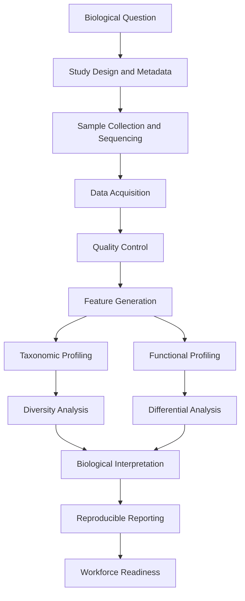
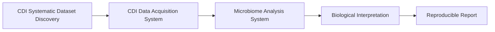

# Microbiome Analysis System

**From microbial communities to defensible biological insights.**

The **Microbiome Analysis System (MAS)** is a reproducible workflow guide for moving from microbiome study design and sequencing data to quality control, feature generation, profiling, interpretation, reporting, and workforce-ready outputs.

This project is part of the **Complex Data Insights (CDI) Omics Systems** series.

---

## Overview

Microbiome analysis is more than running tools. A defensible workflow requires clear links between the biological question, metadata, sequencing data, quality control, feature tables, profiles, statistics, interpretation, and reporting.

MAS organizes that process as a complete analytical system.



---

## What This System Covers

The guide includes:

- study design and metadata planning
- sequencing strategy context
- data acquisition handoff from CDI-DAS
- FASTQ quality-control checks
- example feature table generation
- taxonomic profiling
- diversity analysis
- functional profiling concepts
- differential analysis structure
- biological interpretation support
- reproducible reporting
- workforce readiness and portfolio evidence

The system includes both explanatory Quarto chapters and runnable example scripts.

---

## Repository Structure

```text
microbiome-analysis-system/
├── _quarto.yml
├── index.qmd
├── 00-preface.qmd
├── 01-system-overview.qmd
├── 02-study-design-and-metadata.qmd
├── 03-sample-collection-and-sequencing.qmd
├── 04-data-acquisition.qmd
├── 05-quality-control.qmd
├── 06-feature-generation.qmd
├── 07-taxonomic-profiling.qmd
├── 08-diversity-analysis.qmd
├── 09-functional-profiling.qmd
├── 10-differential-analysis.qmd
├── 11-biological-interpretation.qmd
├── 12-reproducible-reporting.qmd
├── 13-workforce-readiness.qmd
├── 999-appendix.qmd
├── 999-references.qmd
├── scripts/
│   ├── bash/
│   └── R/
├── data/
├── figures/
├── tables/
├── library/
│   └── references.bib
├── docs/
└── environment.yml
```

---

## Environment Setup

Create the MAS conda environment:

```bash
conda env create -f environment.yml
```

Activate it:

```bash
conda activate cdi-microbiome
```

Check the R packages:

```bash
Rscript -e "library(readr); library(dplyr); library(tidyr); library(tibble); library(ggplot2); library(stringr); library(glue); sessionInfo()"
```

---

## Render the Book

Render the Quarto book:

```bash
quarto render
```

Preview locally:

```bash
quarto preview
```

Rendered HTML output is written to:

```text
docs/
```

---

## Toy Workflow Run Order

The repository includes a small toy workflow for testing the system structure.

Run from the project root:

```bash
bash scripts/bash/04a-create-example-acquisition-data.sh
bash scripts/bash/04b-check-data-acquisition.sh

bash scripts/bash/05a-check-fastq-files.sh
bash scripts/bash/05b-build-qc-readiness-report.sh

bash scripts/bash/06a-create-example-feature-table.sh
bash scripts/bash/06b-check-feature-table.sh

bash scripts/bash/07a-build-taxonomic-profile.sh
Rscript scripts/R/07b-plot-taxonomic-profile.R

Rscript scripts/R/08a-calculate-diversity-metrics.R
Rscript scripts/R/08b-plot-diversity-results.R

bash scripts/bash/09a-create-example-functional-profile.sh
Rscript scripts/R/09b-plot-functional-profile.R

Rscript scripts/R/10a-run-example-differential-analysis.R
Rscript scripts/R/10b-plot-differential-results.R

Rscript scripts/R/11a-build-interpretation-evidence.R
Rscript scripts/R/11b-draft-interpretation-notes.R

Rscript scripts/R/12a-build-report-inventory.R
Rscript scripts/R/12b-create-analysis-summary-report.R

Rscript scripts/R/13a-build-skills-matrix.R
Rscript scripts/R/13b-create-portfolio-summary.R
```

---

## Important Toy Data Warning

The example data generated by the scripts are artificial.

They are intended only to test workflow structure and demonstrate reproducible file organization.

They should **not** be used for:

- biological interpretation
- publication
- statistical inference
- claims about human health
- claims about microbial function
- benchmarking real microbiome methods

Use real data only after appropriate study design, metadata review, quality control, and method selection.

---

## Relationship to CDI Systems

MAS is designed to work downstream of other CDI systems.



- **CDI Systematic Dataset Discovery** helps identify suitable public datasets.
- **CDI Data Acquisition System** retrieves and validates public sequencing data.
- **Microbiome Analysis System** performs analysis, interpretation, and reporting.

---

## Main Outputs

A complete toy MAS run can generate:

```text
data/reports/data-acquisition-summary.tsv
data/qc/fastq-qc-summary.tsv
data/reports/qc-readiness-report.tsv
data/features/feature-table.tsv
data/reports/feature-table-check-report.tsv
data/taxonomy/genus-relative-abundance.tsv
data/reports/taxonomic-profile-report.tsv
data/diversity/alpha-diversity.tsv
data/reports/diversity-analysis-report.tsv
data/function/pathway-abundance.tsv
data/reports/functional-profile-report.tsv
data/differential/example-differential-results.tsv
data/reports/differential-analysis-report.tsv
data/interpretation/biological-interpretation-notes.md
data/reporting/mas-analysis-summary-report.md
data/workforce/mas-portfolio-summary.md
```

Generated toy outputs are local workflow products and are not required to be committed.

---

## Intended Audience

This system is designed for:

- students learning microbiome analysis
- early-career bioinformatics analysts
- researchers organizing microbiome workflows
- mentors teaching omics analysis
- practitioners building reproducible microbiome reports
- CDI omics workflow development

---

## Project Philosophy

MAS follows a systems-first approach.

The goal is not only to run microbiome tools, but to preserve the reasoning chain:

```text
question → data → quality → features → profiles → statistics → interpretation → report
```

A microbiome result is only as defensible as the design, metadata, data quality, workflow decisions, and interpretation that support it.

---

## License

Add the appropriate license for this repository.

---

## Citation and References

Key references are listed in:

```text
library/references.bib
999-references.qmd
```

The guide includes references to common microbiome analysis tools and reproducible microbiome data science resources, including QIIME 2, DADA2, phyloseq, and bioBakery.

---

## Maintainer

**Teresia Mrema Buza**  
Complex Data Insights
